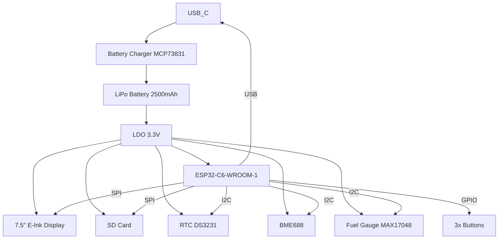

# Proiect TSC 2025 - OpenBook

## 1. Diagramă bloc a proiectului

## 2. Bill of Materials (BOM)

| Componentă           | Tip / Cod produs                     | Magazin                            | Datasheet / Link |
|------------------------|--------------------------------------|------------------------------------|------------------|
| ESP32-C6-WROOM-1-N8    | Modul ESP32                          | [Mouser](https://www.mouser.com/) | [Datasheet](https://www.espressif.com/sites/default/files/documentation/esp32-c6-wroom-1_datasheet_en.pdf) |
| MCP73831               | Battery Charger                      | [Comet](https://www.comet-electronique.com) | [Datasheet](https://ww1.microchip.com/downloads/en/DeviceDoc/20001984g.pdf) |
| MAX17048               | Fuel Gauge                           | [Mouser](https://www.mouser.com/) | [Datasheet](https://datasheets.maximintegrated.com/en/ds/MAX17048-MAX17049.pdf) |
| DS3231                 | RTC                                  | [Mouser](https://www.mouser.com/) | [Datasheet](https://datasheets.maximintegrated.com/en/ds/DS3231.pdf) |
| BME688                 | Senzor mediu                         | [Mouser](https://www.mouser.com/) | [Datasheet](https://www.bosch-sensortec.com/media/boschsensortec/downloads/datasheets/bst-bme688-ds000.pdf) |
| 7.5" E-Ink Display     | Waveshare WSH-13187                  | [Waveshare](https://www.waveshare.com/) | [Specificație](https://www.waveshare.com/wiki/7.5inch_e-Paper_V2) |
| SD Card Socket         | 112A-TAAR-R03                         | [Comet](https://www.comet-electronique.com) | - |
| Butoane x3             | Tactile switch                       | [Comet](https://www.comet-electronique.com) | - |
| Condensatori 100nF     | SMD 0402                             | [Mouser](https://www.mouser.com/) | - |
| Rezistențe diverse    | SMD 0402                             | [Mouser](https://www.mouser.com/) | - |
| LDO 3.3V               | XC6220A331MR                         | [Mouser](https://www.mouser.com/) | [Datasheet](https://datasheet.lcsc.com/lcsc/1810271011_Torex-Semicon-XC6220A331MR-G_C5446.pdf) |

## 3. Descriere hardware

### Microcontroller ESP32-C6-WROOM-1
ESP32-C6 este nucleul principal al dispozitivului. Are conectivitate Wi-Fi 6, Bluetooth LE, interfațe SPI, I2C, USB 2.0. Este alimentat la 3.3V printr-un LDO. Are 8MB de flash extern.

### Afișaj E-Paper
Un ecran Waveshare de 7.5" este utilizat pentru afișare statică, ideal pentru consum redus. Comunică prin SPI (MOSI, MISO, CLK, CS), având pinii de control DC, RST și BUSY.

### Managementul energiei
Dispozitivul este alimentat de la o baterie LiPo 3.7V 2500mAh. Încărcarea se face prin MCP73831, conectat la USB-C. LDO-ul (XC6220A331MR) convertește tensiunea la 3.3V. MAX17048 monitorizează nivelul bateriei.

### Senzori
- **BME688**: măsoară temperatura, presiunea, umiditatea și calitatea aerului. Se conectează prin I2C.
- **DS3231**: ceas de timp real precis, conectat prin I2C.

### Stocare
- **SD Card**: permite stocarea eBook-urilor și a log-urilor. Comunicare prin SPI.

### Interacțiune
- **Butoane**: trei butoane tactile sunt conectate la GPIO pentru controlul meniului sau a paginilor.

### Alte detalii hardware
- Toate componentele pasive sunt SMD 0402.
- PCB-ul este cu 2 straturi, 1mm grosime.
- Antena ESP32 este orientată spre exterior, fără trasee în zona sa.
- Silkscreen-ul este clar, conține doar numele componentelor.
- Decuplarea s-a realizat cu condensatori de 100nF aproape de fiecare circuit integrat.

## 4. Alocarea pinilor ESP32-C6

| Pin ESP32-C6 | Componentă             | Funcție                     |
|--------------|--------------------------|-------------------------------|
| GPIO1        | SDA                      | I2C - toți senzorii         |
| GPIO2        | SCL                      | I2C - toți senzorii         |
| GPIO5        | SPI MISO                 | Display / SD card             |
| GPIO6        | SPI MOSI                 | Display / SD card             |
| GPIO7        | SPI CLK                  | Display / SD card             |
| GPIO8        | SPI CS (Display)         | Select display                |
| GPIO9        | DC (Display)             | Control display               |
| GPIO10       | RST (Display)            | Reset hardware                |
| GPIO11       | BUSY (Display)           | Status display                |
| GPIO12       | Button 1                 | Navigare                      |
| GPIO13       | Button 2                 | Selectare                     |
| GPIO14       | Button 3                 | Întoarcere / Menșinere      |
| GPIO15       | ALERT (MAX17048)         | Semnal baterie scăzută     |
| GPIO16       | USB D+                   | USB 2.0                       |
| GPIO17       | USB D-                   | USB 2.0                       |
| GPIO18       | LED (status)             | Indicator                     |
| GPIO19       | CS (SD card)             | Select card                   |
| GPIO20       | MISO (SD)                | Date de la card               |
| GPIO21       | MOSI (SD)                | Date spre card                |
| GPIO4        | CLK (SD)                 | Clock                         |

## 5. Observații despre proiectare

- S-au folosit trasee de alimentare de 0.3mm, semnalele de date au 0.15mm.
- Nu s-au folosit unghiuri drepte la trasee.
- Vias-urile la alimentare au fost evitate pe cât posibil.
- Via stitching aplicat în jurul planurilor de masă.
- Decupaj sub antena ESP32, fără planuri GND sau semnale.
- Amplasarea componentelor respectă ghidul mecanic.

## 6. Alte informații utile

- Modelul 3D complet (PCB + baterie + display + carcasă) este exportat în format `.step`.
- Modelul a fost realizat în Fusion360, cu toate componentele integrate.
- Test pad-urile sunt marcate clar cu numele semnalelor.

Repo-ul include:
- Gerbers
- .brd și .sch
- BOM + Pick and Place
- Randări din Fusion360
- Imagini cu PCB-ul

